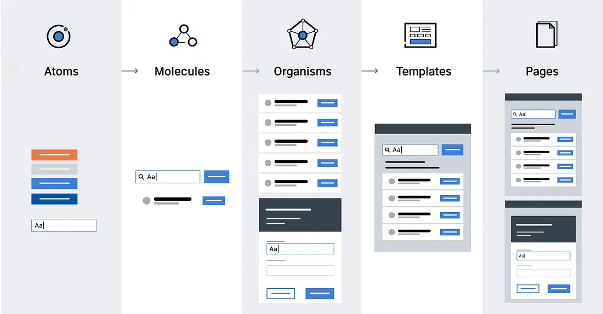

# My Tech Test Submission

- [🎯 Approach](#approach)
- [🛠️ Technologies Used](#technologies-used)
- [🧪 Testing](#testing)
- [🗂️ Project Structure](#project-structure)
- [🏗️ Component Breakdown](#component-breakdown)
- [🔮 Further Development](#further-development)

## 🎯 Approach

I really enjoyed this task, and it had a few possible directions to take in the implementation. I came at this task with the following goals in mind to try and keep my approach focussed:

- **🚤 MVP**: Produce the leanest code that achieves each requirement
- **🏁 Complete the test**: Aim to complete all the core functionality in the three hour window (no styles, happy path only)
- **🏆 Best practises**: Try to consider testing, a11y, performance, and scaleability in what I produce
- **💅 Add the polish later**: Add styles, animations, and polish towards the end
- **😤 Unhappy paths**: Spend time covering off unhappy paths (e.g. network error or no posts found when searching)

### Key Decisions

1. **No UI framework**: I wanted to demonstrate at least some styling skills in this test, and using a UI framework (i.e. tailwindcss or shadcn) seemed like using a sledgehammer to hammer a nail in such a small app. That being said, Material UI has heavily influenced the look and feel of this app.

2. **Container components aren't unit tested**: This is because the underlying hooks and API calls are covered in tests, so I'd have been duplicating those simply to add coverage.

3. **Coverage**: I've added a coverage command `yarn coverage` to inform what areas of the code are missing tests. Some page-level components are missing coverage, but again, the functionality is covered lower down in the atoms/molecules/organisms. I'd usually aim for around 80% coverage, as a higher percentage can lead to tests that provide no value other than to increase the score (e.g. "it renders" tests).

4. **Skeleton components**: I'd have really liked to use skeleton loading components to improve the page render times and to improve the overall experience but I just didn't have time.

## 🛠️ Technologies Used

I tried to keep the technologies used to a minimum, and to only introduce a framework (such as `react-query`) when I deemed it necessary, i.e. the benefits they bring outweigh the potential maintenance tradeoffs later down the line.

### [`react-query`](https://tanstack.com/query/latest/docs/framework/react/overview)

> React Query is hands down one of the best libraries for managing server state. It works amazingly well out-of-the-box, with zero-config, and can be customized to your liking as your application grows.

Rather than use `createContext` and spend time creating all the boilerplate needed for the apps state management (time was tight!), I chose to let `react-query` do the heavy lifting for me.

The setup time wasn't the main reason for using it though, it brings many more advantages which include:

- An opinionated way of fetching or updating data in a holistic way
- Make the application more maintainable and easier to build new features without worrying about wiring up new server state data sources
- Improve the experience of our end-users by making the application feel faster and more responsive
- Potentially help you save on bandwidth and increase memory performance (brings caching, garbage collection, etc)

#### Usage

The `App` is wrapped in a `QueryClientProvider` which provides a persisted `queryClient` to the whole app. This client maintains the cache, controls query invalidation, and ultimately houses the data when display.

```js
// App.tsx
export const App = () => (
  <QueryClientProvider client={queryClient}>
    <Homepage />
  </QueryClientProvider>
);
```

We `useQuery` to fetch the initial posts displayed in the app:

```js
// use-posts.ts
useQuery({
  queryKey: ["posts"],
  queryFn: () => fetchPosts(0, 100),
});
```

And `useMutation` to update the posts in our state on the back of an API call:

```js
// use-posts.ts
useMutation({
  mutationFn: () => deletePost(post.id),
  onSuccess: () => removePostFromData(post.id, queryClient),
});
```

### 🪝 Custom `usePosts` hook

All the queries and mutations have been contained in a conventient `usePosts` hook, which makes interacting with the app state really simple, and hides away all the logic to keep our components clean and lightweight.

This is how the hook is used in our `PostListContainer`:

```js
// post-list.container.tsx
const { getPostsQuery } = usePosts();
const { data, isLoading, isError, isLoadingError } = getPostsQuery();
```

## 🧪 Testing

### 🚦 TDD (Test Driven Development)

Where possible I've worked using TDD, starting with a failing test, make it green, then refactor to improve the code.

I like to use a VSCode plugin called [`wallaby.js`](https://wallabyjs.com/) to help writing tests and refactoring my code. It runs inside the editor and runs the open tests immediately as I type, and displaying the results next to the affected lines.

### 🔺 Testing Pyramid


The testing pyramid is a visual metaphor that describes the ideal proportion of different types of tests in a software project. It emphasizes the importance of having a solid base of low-level tests and fewer higher-level tests.

Here's a breakdown of the pyramid layers, from bottom to top:

1. **Unit Tests (The Base)**:

- **Purpose**: Test individual units of code in isolation, such as functions, classes, or modules. They verify that each part of the code works correctly on its own.
- **Scope**: Smallest and most granular level of testing.
- **Speed**: Fast to run, as they don't involve external dependencies.
- **Frequency**: Should be written for almost every unit of code. This forms the broad base of the pyramid.

2. **Integration Tests (The Middle)**:

- **Purpose**: Verify that different units of code work together correctly. They check the interactions between components, modules, or systems.
- **Scope**: Broader than unit tests, covering the integration of multiple units.
- **Speed**: Slower than unit tests, as they may involve external dependencies (databases, APIs, etc.).
- **Frequency**: Fewer than unit tests, but still a significant part of the testing strategy.

3. **End-to-End (E2E) Tests (The Top)**:

- **Purpose**: Simulate real user scenarios to test the entire application flow from start to finish. They verify that all parts of the system work together correctly in a realistic environment.
- **Scope**: Widest scope, covering the entire application.
- **Speed**: Slowest type of test, as they involve the entire application stack and often a browser or other UI automation.
- **Frequency**: Fewest in number, as they are expensive to write and maintain. Focus on the most critical user flows.

## 🗂️ Project Structure

The project structure is largely what was perscribed in the test. I've added a few new folders though which are detailed below:

```
twinkl-react-tech-test-main/
├── ...
├── .husky
│   └── pre-commit              // runs lint-staged
├── src/
│   ├── api/
│   |   └── jsonplaceholder.ts  // data layer to interact with the posts api
│   ├── components/
│   |   ├── atoms               // base level components (e.g. buttons)
│   |   ├── molecules           // components made up of one or more atoms
│   |   ├── organisms           // components made up of molecules and/or atoms
│   |   ├── pages               // top level pages built up of multiple organisms
│   ├── hooks/
│   |   └── use-post.ts         // a hook to provide state management functions
│   ├── lib/
│   |   └── query-client.ts     // our persisted queryClient
│   ├── utils/
│   |   └── testing/            // utilities for mocking in our tests
│   └── App.css                 // global app styles and defaults
└── .editorconfig
```

## 🏗️ Component Breakdown

### ⚛️ Atomic Design Pattern



Atomic Design is a methodology for designing and building user interfaces by breaking them down into smaller, reusable components.

Using Atomic Design principles in React offers several significant advantages:

1. **Increased Reusability**: Atomic Design encourages you to think about your UI in terms of its smallest, indivisible parts ("atoms"). These atoms (e.g., buttons, labels, inputs) are highly reusable across your application. By building components from these reusable atoms, you avoid redundant code and create a consistent UI. If you need to change a button's style, you change it once in the atom, and the change propagates everywhere it's used.

2. **Improved Consistency**: Because components are built from a common set of atoms, your UI will have a consistent look and feel. This leads to a better user experience, as users will find familiar elements throughout your application. Atomic Design provides a clear hierarchy, making it easier to maintain consistency across different parts of the application.

3. **Easier Development and Maintenance**: Working with smaller, modular components is generally easier than working with large, complex ones. Atoms are simple to develop and test in isolation. When you need to make changes, you can often target the specific atom or molecule, rather than having to modify a large, entangled component. This makes maintenance less risky and more efficient.

4. **Scalability**: As your application grows, Atomic Design makes it easier to scale your UI. You already have a library of reusable components that you can combine and recombine to create new features and pages. This modularity also makes it easier to onboard new developers, as they can quickly understand the component structure and start contributing.

5. **Better Collaboration**: Atomic Design provides a common language for designers and developers to discuss the UI. It helps bridge the gap between design and development. Designers can focus on creating the visual language (atoms, molecules, organisms), while developers can focus on the technical implementation.

6. **Easier Testing**: Small, isolated components are easier to test thoroughly. You can unit test each atom, molecule, and organism independently. This leads to more robust and reliable code.

7. **Design Systems**: Atomic Design is a natural fit for creating and maintaining design systems. The hierarchical structure makes it easy to organize and document components within a design system.

#### Further reading

- [Atomic Design Methodology](https://atomicdesign.bradfrost.com/chapter-2/) by Brad Frost
- [Atomic Design Pattern: How to set up your Reactjs Project Structure?](https://programmingly.dev/atomic-design-pattern-how-to-set-up-your-reactjs-project-structure/)

### 📦 Containers

I've created containers for each presentational component to serve as a bridge between the data layer (e.g. API calls, state management) and our presentational components.

This has several key benefits:

1. **Separation of Concerns:** Containers separate data fetching and business logic from how that data is displayed. This is a **core principle of clean architecture**. Presentational components become simpler and focused solely on rendering the UI. They receive data as props and don't need to know where it comes from or how it's fetched. This separation makes your code more organized, maintainable, and testable. You can change your data fetching logic without affecting your presentational components, and vice-versa.

2. **Reusability of Logic**: The data fetching and processing logic within a container can be reused across multiple presentational components. If you need to display the same data in different ways, you can use the same container. This avoids code duplication and **makes your codebase more DRY** (Don't Repeat Yourself).

3. **Data Management and State**: Containers often manage the component's state related to the data. They can handle loading states, error states, and caching. This keeps the presentational components stateless or "dumb", which makes them easier to reason about and test.

4. **Abstraction of Data Source**: Containers abstract away the details of how data is fetched. Your presentational components don't need to know if the data comes from an API, a local database, or a Redux store. This makes it easier to switch data sources later without modifying the presentational components.

5. **Performance Optimization**: Containers can implement performance optimizations like memoization or caching to avoid unnecessary re-renders. They can also manage subscriptions to data stores efficiently.

6. **Testing**: Because containers are separate from presentational components, they are easier to unit test in isolation. You can mock the data fetching logic and test the container's behavior.

## 🔮 Further Development

I could have kept tinkering with this app for days, weeks even, but there had to be a point where I drew a line in the sand and called it a day. That being said, if I was to carry on adding to this app, there are a few key things missing:

### 1. E2E Tests ([Cypress.io](https://www.cypress.io/) or [Playwright](https://playwright.dev/))

This part of the Testing Pyramid is currently missing, but is crucial for a production application, and would be the next feature I added to the project.

I have a lot of experience with [cypress.io](https://www.cypress.io/), but there have been a few concerns about it's future and I know a lot of companies are moving to [playwright](https://playwright.dev/) instead.

### 2. Visual Regression Tests (Snapshots, [Percy](https://percy.io/) or [BackstopJS](https://garris.github.io/BackstopJS/))

I know a lot of companies that don't invest in visual regression testing, but I personally feel like it's a critical test suite that can catch some very unexpected visual styling issues that can occur when new developers being contributing to a large project.

These tests are probably optional, but recommended.

### 3. Component Library (Storybook or Styleguidist)

I once coined the term **"Storybook Driven Development"**, and it sums up my preferred way of creating new reusable components. From experiencem, not having a component library built into a project from the start can lead to very bad times later down the line.

Here's a breakdown of the key advantages:

1. **Component Isolation**: Developing and testing components in isolation makes it easier to focus on the component's specific functionality and appearance without distractions from other parts of the UI. This isolated environment also helps in identifying and fixing bugs more quickly, as you can pinpoint the issue to the component itself.

2. **Improved Component Reusability**: By showcasing all your components in a catalog (the Storybook UI), Storybook encourages you to think about component reusability from the start. Developers can easily browse the Storybook and discover existing components that can be reused in different parts of the application. This reduces code duplication and promotes consistency across the UI.

3. **Faster Development Workflow**: Developing components in Storybook is often faster than developing them within the full application context. You don't need to navigate through the app to find the component you're working on. Hot reloading in Storybook allows you to see changes to your components instantly, speeding up the development and testing process.

4. **Enhanced Visual Testing**: Storybook provides a visual representation of your components in different states and variations. This makes it easy to visually verify that components are rendering correctly and consistently across different browsers and devices. Add-ons like addon-a11y help you check for accessibility issues directly within Storybook. Snapshot testing add-ons allow you to automatically detect unintended visual changes to your components.

5. **Better Collaboration**: Storybook serves as a central hub for all your UI components. Designers, developers, and product managers can easily access and review the components. This facilitates communication and collaboration between team members, ensuring everyone is on the same page regarding the UI. Storybook can also be used for design handoff, making it easier for developers to implement the designs.

6. **Documentation**: Storybook can be used to document your components. You can add descriptions, usage examples, and code snippets to each story, making it easier for others (and your future self) to understand how to use the components. Some add-ons can even generate documentation automatically from your component code and stories.

7. **Design System Development**: Storybook is an excellent tool for building and maintaining design systems. It provides a platform for showcasing and documenting the components of your design system. This allows you to create a consistent and reusable UI library that can be shared across multiple projects.
